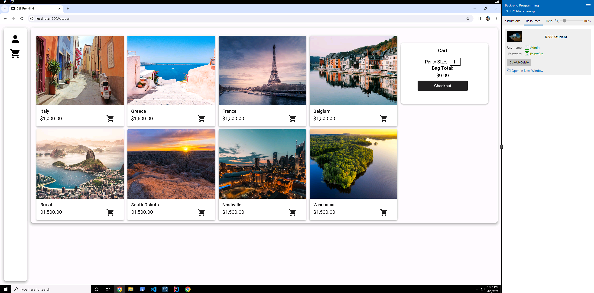
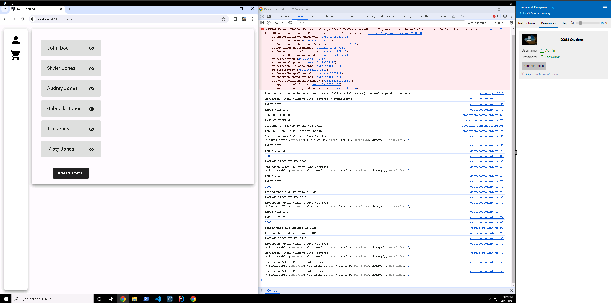
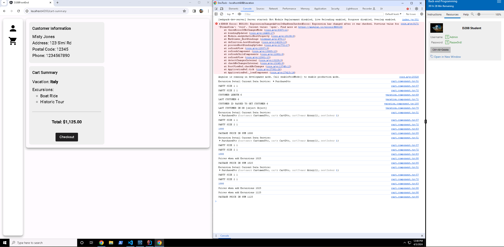
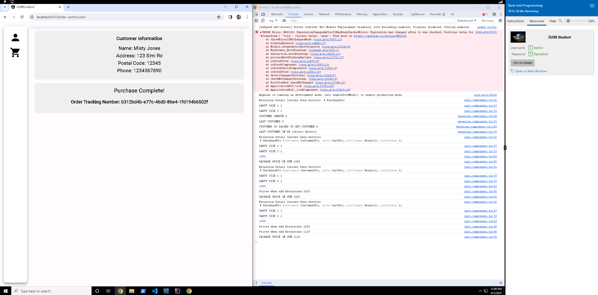
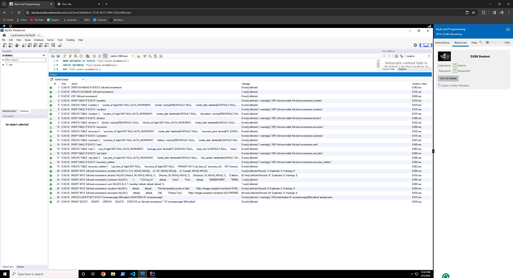

# D288 Back End Programming

## Description
- Developed a Java Spring Boot application for managing vacation packages and checkout forms.
- Integrated Spring Data JPA and Rest Repositories with MySQL Driver for database operations.
- Utilized Lombok for streamlined Java code generation.

### Home Page

## Contributions
- Configured project structure with packages for controllers, entities, dao, and services.
- Implemented entity classes and enums according to UML diagram specifications.
- Created repository interfaces extending JpaRepository in the dao package.
- Developed purchase data and response classes, checkout service interface, and implementation in the services package.
- Added input validation for Angular front-end compatibility.
- Created REST controller in the controllers package for handling customer orders.
- Programmed the addition of five sample customers to the application.
- Ensured seamless integration with Angular front-end for customer order processing.

## Technologies Used
- Java
- Spring Boot
- Spring Data JPA
- Rest Repositories
- MySQL
- Lombok

## Screenshots

#### Customer Page

#### Checkout Page

#### Purchase Receipt

#### MySQL Database
